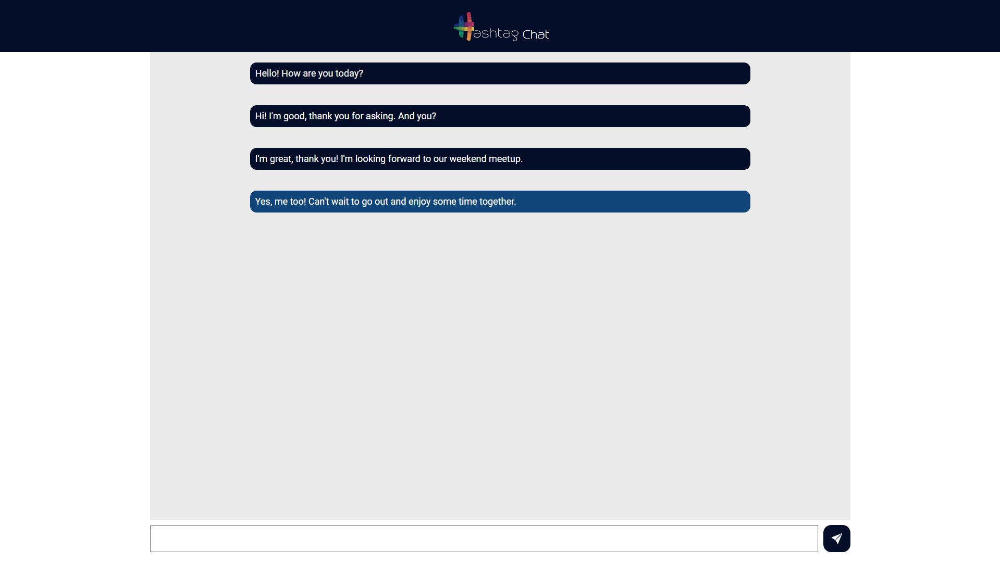

<h1 align="center"> Chat online </h1>

<p align="center">
Project developed during the Hashtag Programming event.
</p>

<p align="center">
  <a href="#-Technologies">Technologies</a>&nbsp;&nbsp;&nbsp;|&nbsp;&nbsp;&nbsp;
  <a href="#-Project">Project</a>&nbsp;&nbsp;&nbsp;|&nbsp;&nbsp;&nbsp;
  <a href="#memo-License">License</a>&nbsp;&nbsp;&nbsp;|&nbsp;&nbsp;&nbsp;

</p>

<p align="center">
  
</p>

<br>

<p align="center">
  
</p>

## 🚀 Technologies

This project was developed using the following technologies:

- Socket.io
- JavaScript
- Express
- HTML5
- CSS3

## 💻 Project

We created an online chat that enables conversation among all users on the same network, using socket.io


## Getting started

### Project cloning

```bash
git clone
```

#### Starting:
```bash
cd hashtag chat
```

```bash
npm install
```

```bash
npm run dev
```

#### Access http://localhost:1000 on any device.

## :memo: License

This project is licensed under the MIT License.

---

